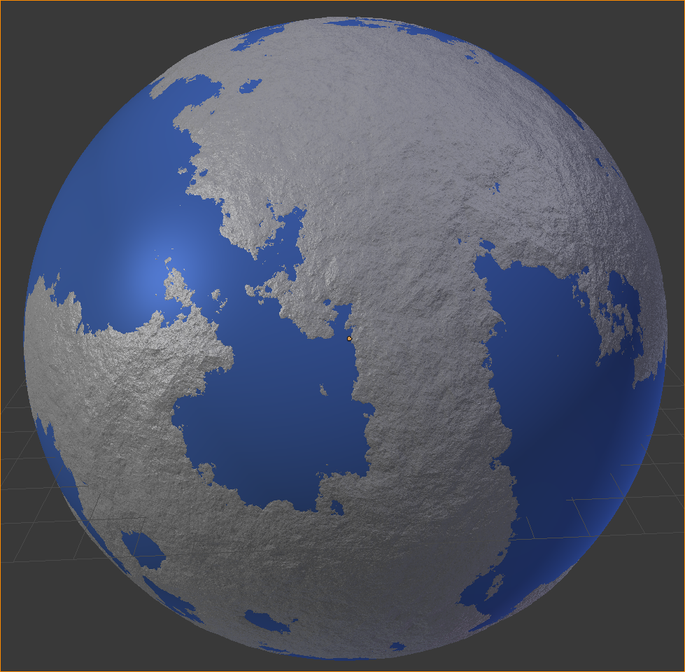
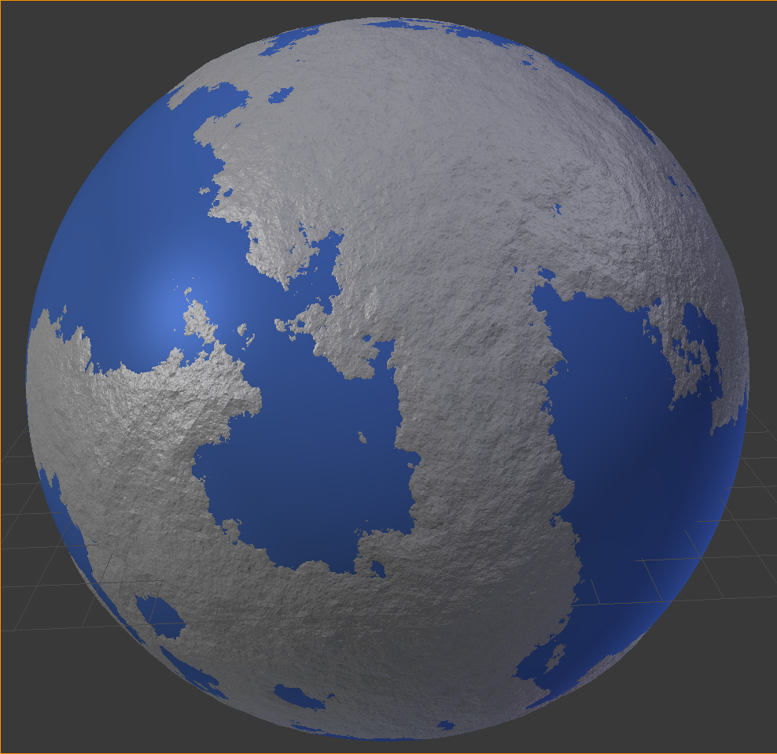
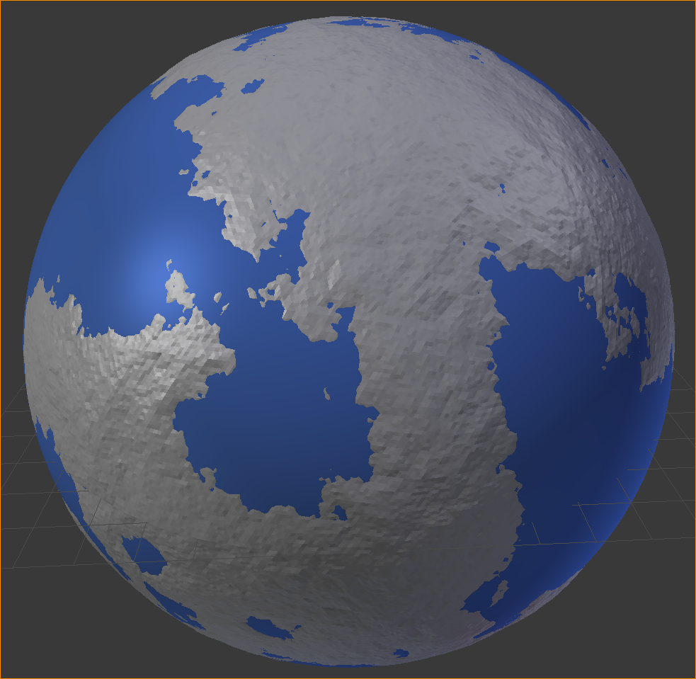
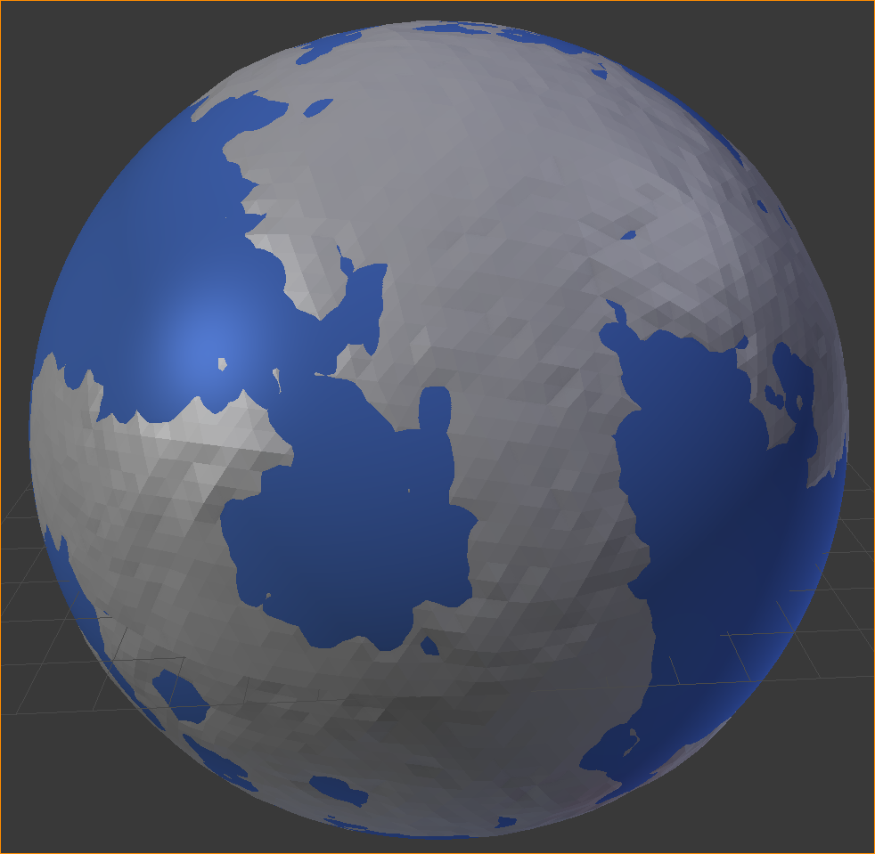

# Procedurally generate planets

The curent version works with a modiefied midpoint-displacement method on a sphere.
It can generate different levels of detail on demand.

I think the generation could be twekead to only generate a small portion in a heigh
level of detail and keep the rest low level, so a player sees everythig in high detail,
while the computer only has to compute a fraction in hd.
